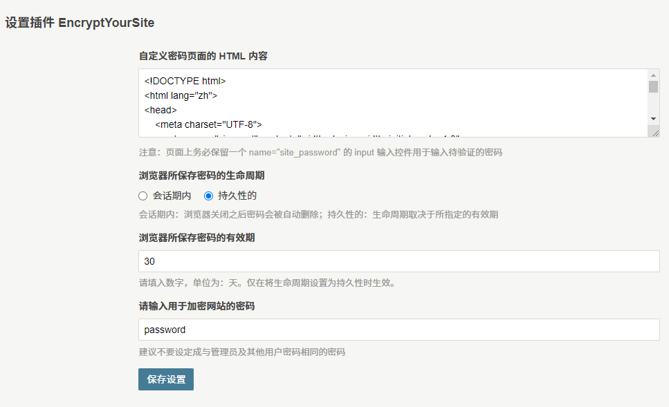
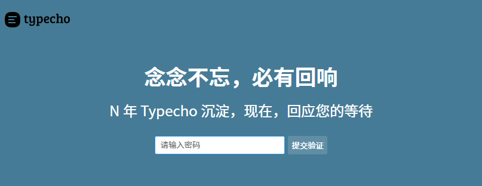

# EncryptYourSite

> Typecho Plugin

## 简介

这是一个用于 Typecho 博客程序的插件，为博客程序添加加密站点的功能。

## 界面预览

- 插件设置界面

- 默认加密界面

## 安装方法

1. 前往 [Releases](https://github.com/LightAPIs/EncryptYourSite/releases/latest) 下载插件压缩包文件。
2. 解压所下载的插件压缩包文件，得到 `EncryptYourSite` 目录，将其上传至服务器 Typecho 插件安装目录 `/usr/plugins/`。
3. 在浏览器里打开 Typecho 后台插件管理页面(默认：`/admin/plugins.php`)，启用该插件即可。此时打开博客首页就可以看到密码验证页面了，默认密码为 `password`，可在插件设置中修改。

## License

[GPL-3.0](./LICENSE) license
